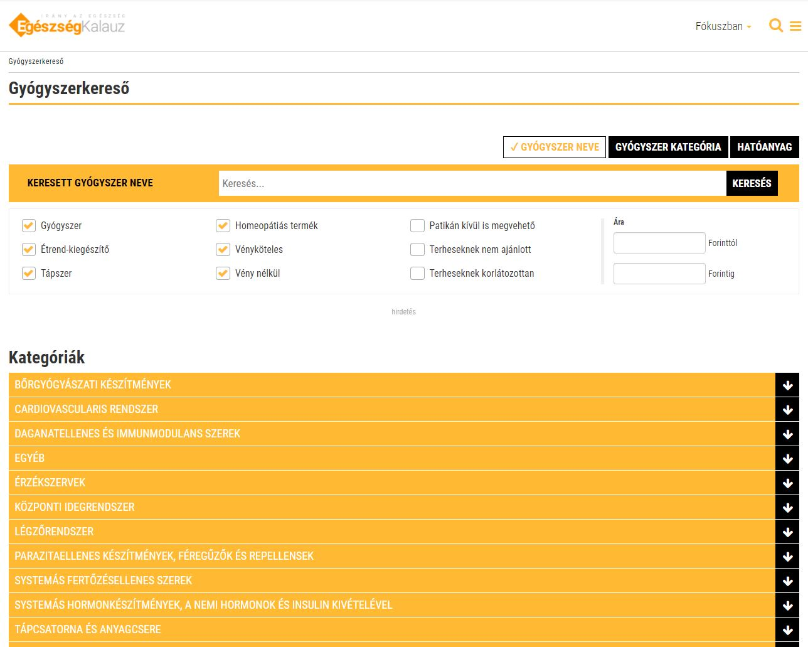

# EGKAPI

## Table of contents
* [General info](#general-info)
* [Description](#description)
* [Screenshot](#screenshot)
* [Technolgies](#technolgies)
* [Setup](#setup)
* [Documentation](#documentation)
* [Developer](#developer)
* [Status](#status)
* [Created](#created)
* [License](#license)

## General info

JSON RPC based Node.js application for the EGK service, that runs on special Ringier Axel Springer UCS platform.

## Description

The application is the api server of the hungarian healthguide site [Egészségkalauz](https://egeszsegkalauz.hu), that contains **interfaces**.

+ geturl: Interface that interprets the url set in parameter. Required parameters: host, path.

+ drugsearch: Drug-seeking application for the hungarian healthguide site, available here: [Egészségkalauz - gyógyszerkereső](https://www.egeszsegkalauz.hu/gyogyszerkereso)

## Screenshot

## Technolgies

+ UCS
+ Node.js 0.8.28.1
+ Vanilla JS
+ JSON-RPC 2.0

## Setup

Install:
    
    cde sdk use node_0.8.28.1

    cde install
    
Start:

    cde sdk use node_0.8.28.1

    cde app

## Documentation

Documentation is available here: ./lib/doc/Egeszsegkalauz-APIdokumentaciover1.17.pdf

## Developer

Ivor Szaniszló: szaniszlo.ivor@ringieraxelspringer.hu

## Status

*Deprecated*

## Created

2018

## License

Copyright
